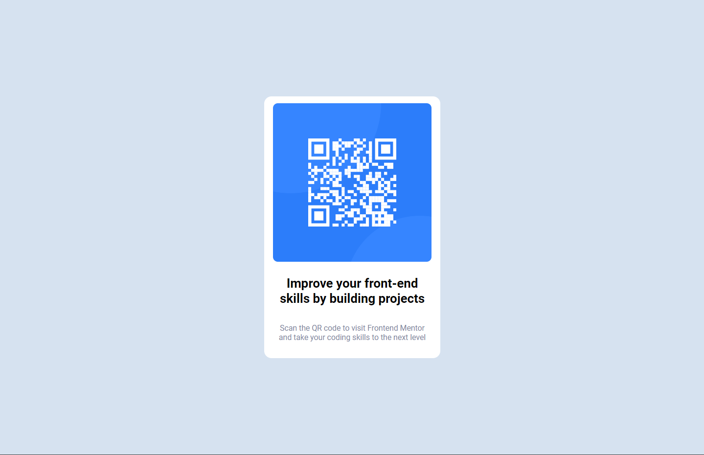

# Frontend Mentor - QR code component solution

This is a solution to the [QR code component challenge on Frontend Mentor](https://www.frontendmentor.io/challenges/qr-code-component-iux_sIO_H). Frontend Mentor challenges help you improve your coding skills by building realistic projects. 

## Table of contents

- [Overview](#overview)
  - [Screenshot](#screenshot)
  - [Links](#links)
- [My process](#my-process)
  - [Built with](#built-with)
- [Author](#author)

## Overview

### Screenshot

### Links

- Solution URL: [Add solution URL here](https://github.com/slowrocky/qr-code-component/tree/main/qr-code-component/src/components/QrCode)
- Live Site URL: [Add live site URL here](https://slowrocky.github.io/qr-code-component/)

## My process

### Built with

- Semantic HTML5 markup
- SCSS custom properties
- Flex
- Mobile-first workflow
- [React](https://reactjs.org/) + Vite - JS library

## Author

- LinkedIn - [LinkedIn](https://www.linkedin.com/in/matus-holotnak/)
- Frontend Mentor - [@slowrocky](https://www.frontendmentor.io/profile/slowrocky)